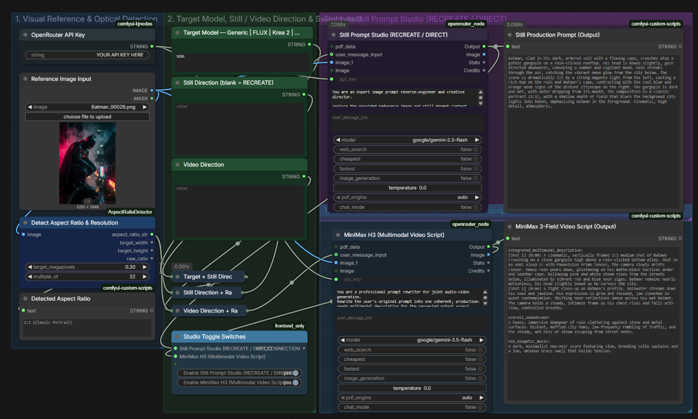

# ComfyUI Prompt Studio Suite v3



**Turn a reference image and a simple idea into a production-ready image prompt or MiniMax H3 video script — directly inside ComfyUI.**

Prompt Studio analyzes your reference image, detects its aspect ratio, and combines that visual context with your creative direction. Use it to reverse-engineer detailed still-image prompts or build structured MiniMax H3 video scripts with shots, camera direction, dialogue, soundscape, and music cues.

---
---

## Features

- **Automatic Aspect Ratio Detection:** Inspects your reference image dimensions and injects dynamic composition parameters directly into the prompt context.
- **Dual Engine Architecture:**
  - **Track A (Still Prompt Generator):** Deconstructs subject, lighting, optics, and framing into single-paragraph diffusion prompts.
  - **Track B (MiniMax H3 Video Script):** Outputs a strict 3-field production script with numbered shots, timestamps, camera motion, diegetic soundscapes, and musical cues.
- **Switchboard Control:** Built-in fast bypass switches to run either engine independently without breaking graph connections.
- **Privacy First:**API Key Safety: OpenRouter credentials are entered through a centralized key input. Never share or publish a workflow after entering your API key without first removing it.

---

## Required Custom Nodes

Install these via the **ComfyUI Manager** before loading the workflow:

| Node Pack | Required Nodes |
|---|---|
| [ComfyUI-Custom-Scripts](https://github.com/pythongosssss/ComfyUI-Custom-Scripts) | `ShowText\|pysssss` |
| [ComfyUI-KJNodes](https://github.com/kijai/ComfyUI-KJNodes) | `StringConstant` |
| [rgthree-comfy](https://github.com/rgthree/rgthree-comfy) | `Fast Bypasser (rgthree)` |
| [openrouter_node](https://github.com/bmad4ever/comfyui-openrouter) | `OpenRouterNode` |
OpenRouter account required: Prompt Studio uses OpenRouter for AI inference. API usage may incur charges depending on the model you select and your OpenRouter account.

*(Core nodes `LoadImage`, `StringConcatenate`, and `PrimitiveStringMultiline` are included natively with ComfyUI.)*

---

## Quick Start

1. Load the workflow: Open prompt_studio_v3.json in ComfyUI using Workflow → Open or drag the .json file directly into the ComfyUI window.
2. Insert your [OpenRouter API Key](https://openrouter.ai/settings/keys) into the **OpenRouter API Key** node (`StringConstant`).
3. Load a target image into **Reference Image Input**.
4. *(Optional)* Add directorial guidelines, character names, or mood constraints into **User Concept / Directorial Notes**.
5. Enable your desired track on the **Studio Toggle Switches** node and click **Queue Prompt**.

---

## Outputs

- **Track A (Stills):** Displayed in the *Still Recreation Prompt (Output)* text box.
- **Track B (Video):** Formatted into standard MiniMax H3 blocks:
  ```text
  integrated_multimodal_description: [Shot 1] ... [Shot 2] ...
  overall_soundscape: ...
  non_diegetic_music: ...
